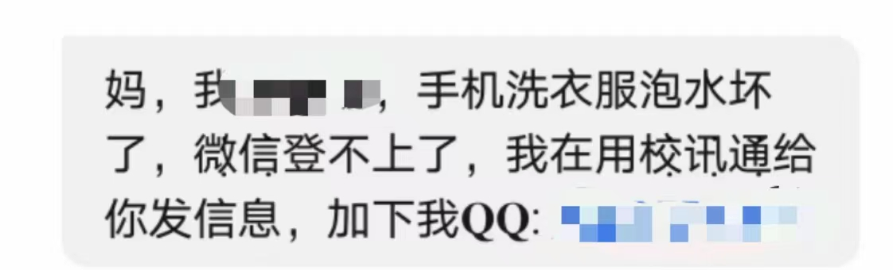
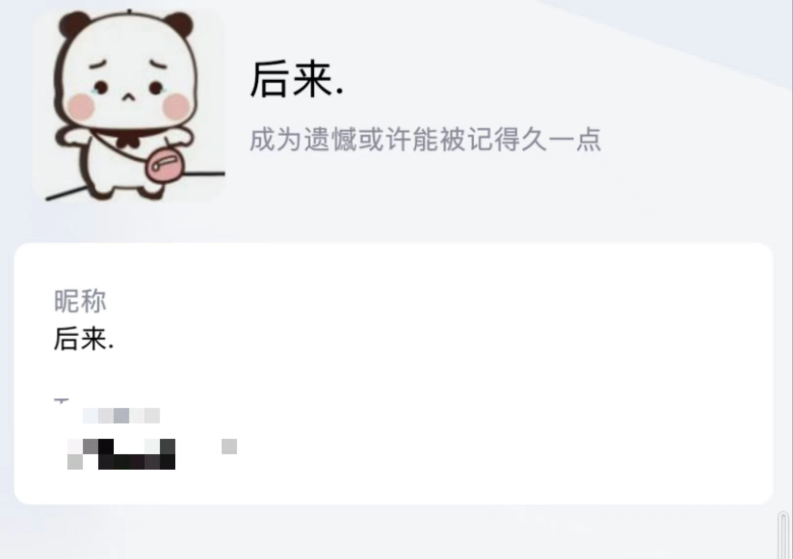
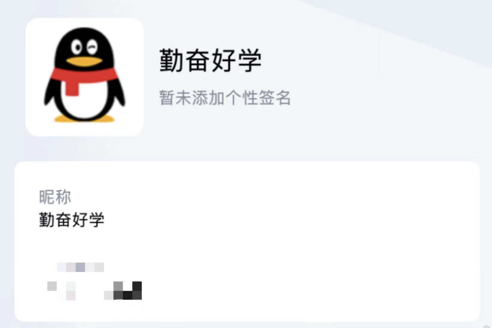

# 记一次公民信息泄漏

于2022年10月31日，不少同学的家长收到了冒充孩子的诈骗短信，诈骗人员尝试通过添加QQ联络到家长。

主要是想练练Markdown和GitHub应用而已，没什么技术含量，一篇水文。

## 事件简介

在2022年10月31日8:00，不少家长收到了以下类似的短信：

诈骗人员以“手机泡水”为由，企图通过QQ联系到家长。

多数信息几乎都在同一时间被发送，发送的号码区号大多是``+7``（俄）、``+852``（香港）、``+84``（越南）等**非``+86``（中国大陆）地区**

## 影响分析

### 受骗

但家长们的防骗意识较好，目前似乎没有家长受骗。

### 隐私泄漏

预计这是从一些含有充分的学籍信息的系统中泄露的个人信息。一般这些信息包括但不限于**姓名、身份证号、民族、出生日期、手机号码**等个人信息；除此之外，该信息应该含有**家庭成员、家庭成员关系、家庭成员电话号码**。

一旦拥有这些信息，不法分子可以轻易将**个人的社会关系**推出，建立较完备的信息库。**影响甚大**。

## 技术分析

### 信息来源

如此完备的信息，而且从短信内容看，主要是针对**大一新生**，预计是在一些 **针对新生信息的平台系统**中泄露。

通过查询最近一些社工库的动态，信息泄漏现象普遍，且信息的**深度**和**广度**都很大。

### 信息的发送

- 使用了中国大陆外地区的网络号码（应该是从网络虚拟运营商批量购买的电话号码）发送。
- 使用了批量发送短信的工具，在同一时间批量发送。
- 短信内容中使用特殊字符以逃避关键字审查，如``微信``、``校讯通``、``QQ``等诈骗常用字符，逃避反诈检查。

### QQ号

- 诈骗人员提供的QQ号预计是被盗的号，有些QQ号的信息还是挺完备的。

- 但有的也应该是临时注册的QQ号，没头像、没签名、没空间 ~~（而且应该没学生的Q名会叫“勤奋好学”吧……~~

## 总结

这次信息泄漏真让我怕了，很明显这背后涉及的个人信息太大了。

希望反诈的 **技术** 工作可以做得更好，虽然运营商目前已默认屏蔽境外号码的来电与短信。

1. 增强 **关键词审查** ，对一些 **可变字符** （如阿拉伯文，还有俗称的“火星文”）的审查更严格些
2. 重点审查境外的网络运营商号码

希望大家能好好保护好自己的个人信息。

1. 工作与个人分开，可以尝试用多个手机号码、邮箱地址分别存有重要与不重要的信息
2. 不要随便提交个人信息到一些来路不明、较小众或境外的网站，对于这些网站，尽量用假信息
3. 在网络发言时尽量不要暴露自己的个人信息。
