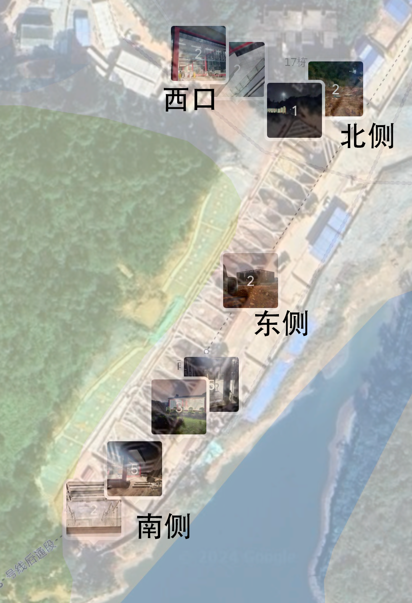

# 夜探“南海大学城”地铁站

*Jimmy Leung 2024/05/07*

晚上无事，去了一趟仍在建设中的佛山地铁3号线南海大学城站探秘，并简单了解了目前的建设情况。

## 西口

在西口，遇到了一位正在驻守站口的工作人员，与他聊了一会儿。关于该线路与此站主要有如下相关情况：

- 目前轨道区已经铺设完毕，主要在建设站内设施；
- 该站有多个站口（但不清楚有几个），但该口仅为入口，站口下只有入闸口。出闸只能从其他站口出（~~但目前路没铺好~~）；
- 目前正在进行电梯测试，将连续测试约一个月以确保正常工作；
- 站内设施很快完工，但站点周边的配套仍未完善（~~路政方面还未为站点铺设附近的道路~~）；
- 地铁建设检查严谨，安全系数高；
- 佛山西站（或附近）的站点未能开通，似乎有（城际？）线路冲突；

这位老哥还跟我分享了不少他的人生经历，还是挺佩服他的。~~或许某天也分享一下~~。

### 侧面

### 正面

## 南口

随着往施工现场中走，发现了南侧也有站口。从卫星图上看，我走过了全是烂泥的站厅上方，来到了南口。在这里，稍微窥见了站厅内部。

### 侧面

### 正面

## 东侧 安全通道？

## 其他“景色”

## 各处位置

使用高德地图与Google卫星图叠加，可能有一定的偏差。

